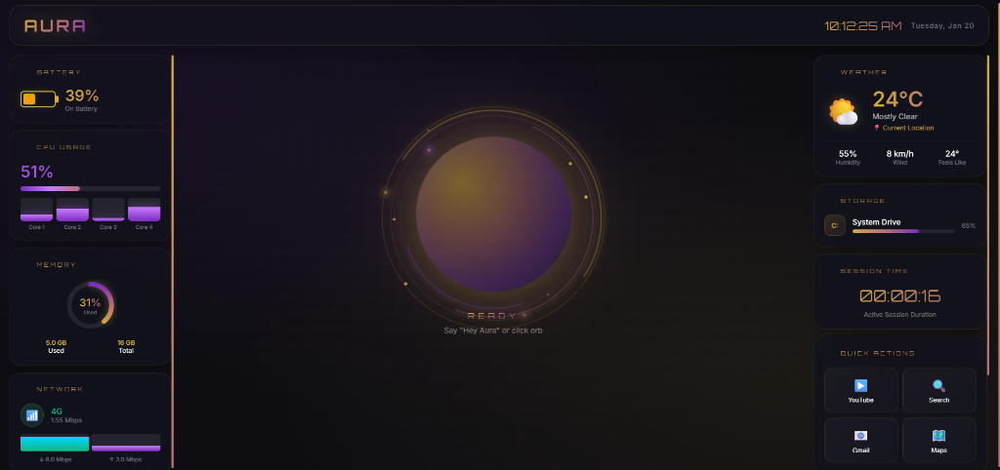

<div align="center">

<!-- Animated Gradient Header -->

 
<br/>
 
<!-- Typing Animation -->


<br/><br/>

<!-- Badges Row -->
[](index.html)
[](LICENSE)
[]()
[]()

<br/>

<!-- Feature Icons -->


</div>

<br/>

---

<br/>

## ✨ The Experience

**AURA** is a **premium JARVIS-style AI assistant** featuring a stunning visual interface with real-time system monitoring, voice activation via "Hey Aura" wake word, and a beautiful glassmorphism design with gold, rose-gold, and purple accents.

<br/>



<br/>

<div align="center">

| 🎯 **Wake Word** | 🔮 **Premium UI** | 📊 **System Monitor** | 🔊 **Voice Response** |
|:--:|:--:|:--:|:--:|
| Say "Hey Aura" to activate | Gold & rose-gold design | CPU, RAM, Battery, Network | JARVIS-style spoken responses |

</div>

<br/>

---

<br/>

## 🚀 Quick Start

### Option 1: Direct Open (Simplest)
```bash
# Just open the file in your browser
# Double-click index.html
```

### Option 2: Local Server
```bash
# 1. Clone the repository
git clone https://github.com/Ram6023/Aura.git

# 2. Navigate to the project
cd Aura

# 3. Start a local server
npx http-server . -p 3000 -o

# 4. Opens automatically at http://localhost:3000
```

<br/>

---

<br/>

## 🎙️ How to Use

<div align="center">

| Step | Action | What Happens |
|:----:|--------|--------------|
| **1** | 🎤 **Allow Microphone** | Click "Allow" when browser asks for mic |
| **2** | 🗣️ **Say "Hey Aura"** | AURA wakes up with a chime and says "I'm listening..." |
| **3** | 💬 **Speak Your Command** | "What's the time?" / "Open YouTube" / "Tell me a joke" |
| **4** | ✨ **See Response Below Orb** | Response appears under the glowing orb |
| **5** | 🔊 **Hear Voice Response** | AURA speaks back to you |

</div>

### Alternative Activation
- **Click the orb** to start listening
- **Press Spacebar** to toggle voice input

<br/>

---

<br/>

## 🌟 Features

<table>
<tr>
<td width="50%">

### 🎤 **Voice Commands**
```
"Hey Aura"           → Wake word activation
"Calculate 5 * 10"   → Math calculator
"Set timer for 10m"  → Visual countdown
"Roll dice / Flip coin" → Randomizers
"How's the weather?" → Weather info
"Battery status"     → Battery level
```

</td>
<td width="50%">

### 🌐 **Quick Actions**
```
"Open [App Name]"    → YouTube, Spotify, Netflix
"Open [Social]"      → WhatsApp, Instagram, X
"Open Gmail/Maps"    → Google Apps
"Search for [topic]" → Google search
"Show latest news"   → Headlines
```

</td>
</tr>
<tr>
<td width="50%">

### 📊 **Real-time Monitoring**
- 🔋 Battery level & charging status
- ⚡ CPU usage with per-core display
- 💾 Memory usage with circular gauge
- 📶 Network speed & connection type
- 🌤️ Live weather (with geolocation)
- ⏱️ Session duration timer

</td>
<td width="50%">

### ✨ **Premium UI Features**
- 🌀 Animated orbital rings
- ✨ Floating particles & sparkles
- 🎨 Gold, rose-gold, purple palette
- 🪟 Glassmorphism effects
- 💫 Smooth animations
- 🔔 Activation chime sound

</td>
</tr>
</table>

<br/>

---

<br/>

## 🔮 Visual States

AURA communicates through mesmerizing visual states:

<div align="center">

```
╭─────────────────────────────────────────────────────────────╮
│                                                             │
│   🟣 READY      →  Say "Hey Aura" or click the orb          │
│   ✨ ACTIVATED  →  Wake word detected, chime plays          │
│   🔵 LISTENING  →  Orb pulses green, capturing command      │
│   💬 RESPONDING →  AI response appears under the orb        │
│   🎲 MORPHING   →  Orb transforms into Dice, Logos, etc.    │
│   🔊 SPEAKING   →  Voice synthesis delivers response        │
│                                                             │
╰─────────────────────────────────────────────────────────────╯
```

</div>

<br/>

---

<br/>

## 🛠️ Technology Stack

<div align="center">

| Technology | Purpose |
|------------|---------|
| **HTML5** | Structure & semantics |
| **CSS3** | Premium styling & animations |
| **JavaScript** | Logic & interactions |
| **Web Speech API** | Voice recognition & synthesis |
| **Navigator APIs** | Battery, Network, Geolocation |
| **Open-Meteo API** | Live weather data |

</div>

<br/>

---

<br/>

## 📁 Project Structure

```
Aura/
├── 📄 index.html         # 🌟 Main AURA application (all-in-one)
├── 📄 manifest.json      # PWA manifest
├── 📄 favicon.png        # Browser tab icon
├── 🖼️ Icon-192.png       # PWA icon (192x192)
├── 🖼️ Icon-512.png       # PWA icon (512x512)
├── 🖼️ Icon-maskable-*.png # Adaptive PWA icons
├── 📄 README.md          # Documentation
└── 📄 .gitignore         # Git ignore rules
```

<br/>

---

<br/>

## 🎨 Design Philosophy

> *"AURA is designed to feel like a living entity—an AI that breathes, pulses, responds with voice, and monitors your system in style."*

The interface draws inspiration from:
- 🤖 **JARVIS from Iron Man** - Voice-activated AI assistant
- 🌌 **Sci-Fi Command Centers** - Futuristic, immersive layouts
- 💎 **Glassmorphism** - Modern depth and frosted effects
- 🏆 **Luxury Branding** - Gold, rose-gold premium accents
- 🌊 **Organic Motion** - Fluid, life-like animations

<br/>

---

<br/>

## 🌐 Browser Support

<div align="center">

| Browser | Voice Recognition | Recommended |
|---------|------------------|-------------|
| **Chrome** | ✅ Full Support | ⭐ Best Experience |
| **Edge** | ✅ Full Support | ✅ Great |
| **Safari** | ⚠️ Limited | Use Chrome |
| **Firefox** | ❌ No Support | Use Chrome |

</div>

> **Note:** Web Speech API works best in Chrome. For the full experience including wake word detection, please use Chrome or Edge.

<br/>

---

<br/>

## 🤝 Contributing

Contributions are welcome! Feel free to:

1. 🍴 Fork the repository
2. 🌿 Create a feature branch (`git checkout -b feature/AmazingFeature`)
3. 💾 Commit your changes (`git commit -m 'Add AmazingFeature'`)
4. 📤 Push to the branch (`git push origin feature/AmazingFeature`)
5. 🔃 Open a Pull Request

<br/>

---

<br/>

## 📄 License

This project is licensed under the **MIT License** - see the [LICENSE](LICENSE) file for details.

<br/>

---

<br/>

<div align="center">

### 💫 Crafted with passion for the future of AI interaction

<br/>

**Say "Hey Aura" and let the magic begin! ✨**

<br/>

**[⬆ Back to Top](#)**

<br/>

<!-- Footer Wave -->


</div>
